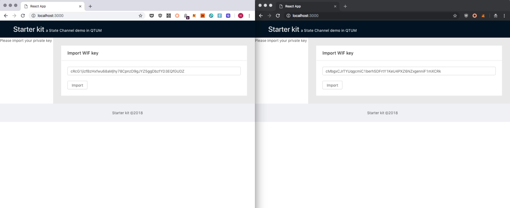
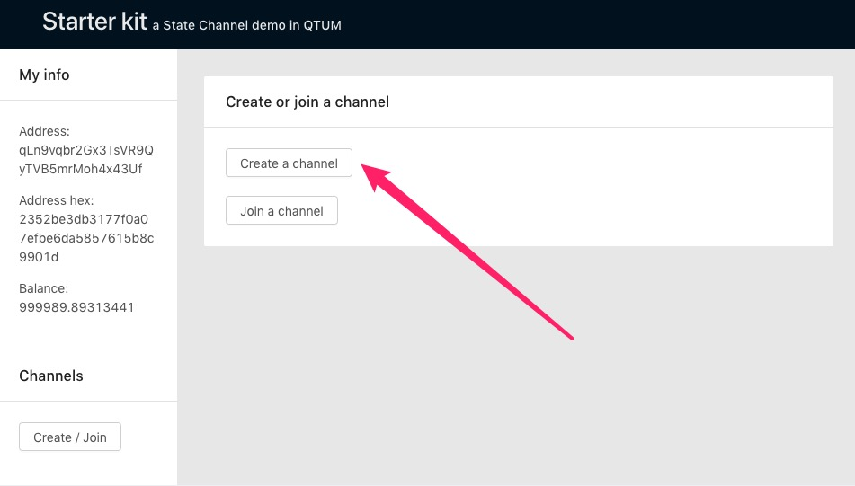
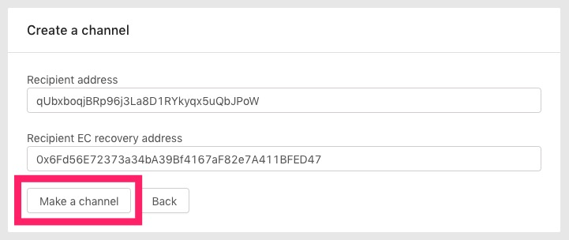
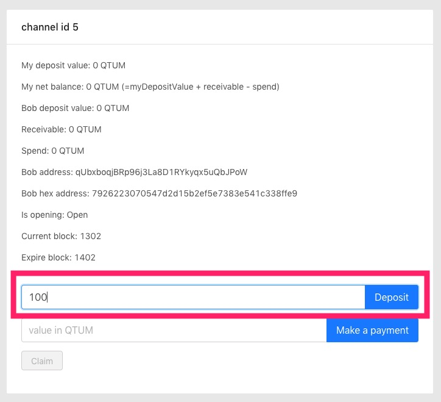
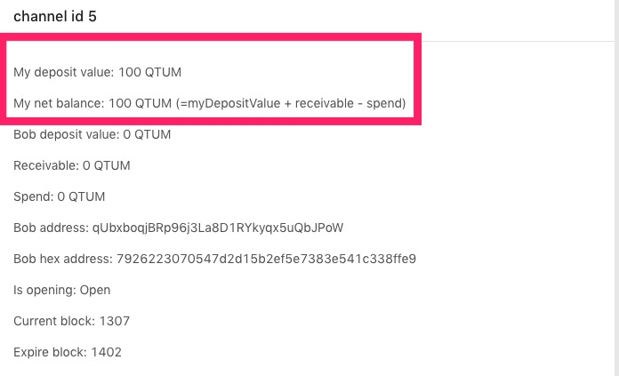
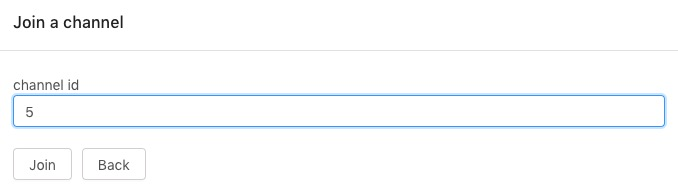
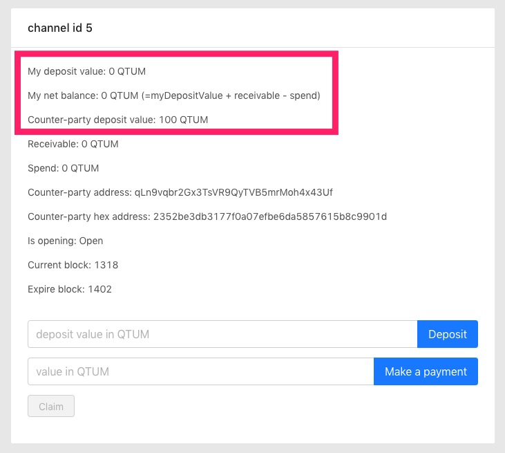
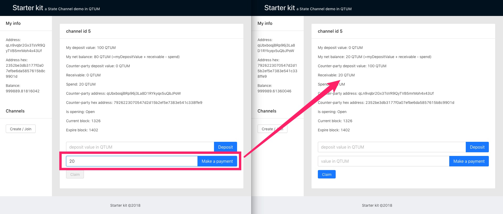
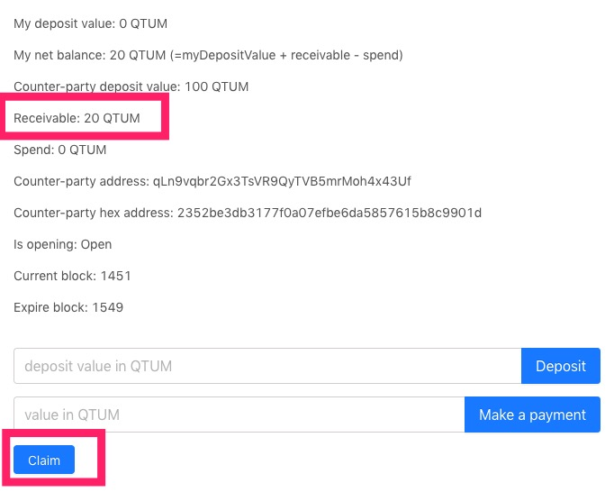
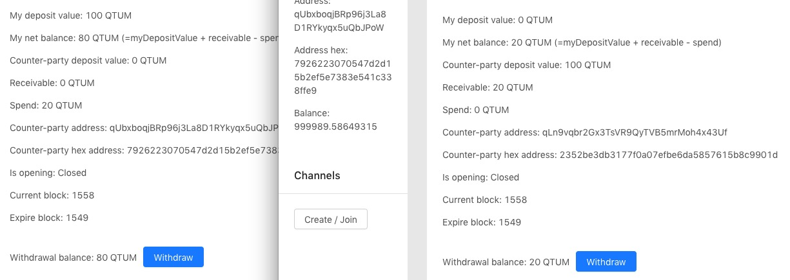

This is a payment channel proof of concept, based on [Sparky: A Lightning Network in Two Pages of Solidity](https://www.blunderingcode.com/a-lightning-network-in-two-pages-of-solidity/).

- Alice can establish open a duplex channel on-chain with Bob.
- Bob can join a channel established by Alice.
- The established channel is duplex, allowing Alice and Bob to pay each other off chain.
- Fund secured by smart contract.
- Users can deposit additional fund to the channel at any time.
- There is a [finalization period](#finalization-period), to allow users to safely withdraw.

# Backend Services

The backend services allow the users to create channel, and relay signed channel states to each other as they make off-chain transactions.

To start the backend services (with docker):

```
make start-services
# wait ~20 seconds for the backend services to start
sleep 20
```

Then fund the test accounts with money:

```
make prefund
```

Finally, deploy the channel contracts:

```
make migrate
```

# Payment Channel DApp

A simple DApp is provided to test the payment channel functionalities.

Follow the instructions in [starter-kit README](starter-kit/README.md) to run the DApp.

## Payment Channel Demo

For the demo, we will use two private keys to represent two users:

```
# Alice
private wif: cRcG1jizfBzHxfwu68aMjhy78CpnzD9gJYZ5ggDbzfYD3EQfGUDZ
address: qLn9vqbr2Gx3TsVR9QyTVB5mrMoh4x43Uf
ecrecovery address: 0x0CF28703ECc9C7dB28F3d496e41666445b0A4EAF

# Bob
private wif: cMbgxCJrTYUqgcmiC1berh5DFrtY1KeU4PXZ6NZxgenniF1mXCRk
address: qUbxboqjBRp96j3La8D1RYkyqx5uQbJPoW
ecrecovery address: 0x6Fd56E72373a34bA39Bf4167aF82e7A411BFED47
```

Open two browser windows, and import the private keys. The users need to have separate browser sessions, so try using incognito mode for one of the test users:



Use Alice to create a channel:



Fill into the form Bob's QTUM address, and his ECRecovery address:



The channel is initially empty, Alice should deposit 100 into it:



After the deposit transaction is confirmed on-chain, there should be 100 in the channel:



Now we are ready to send instantenous payments between Alice and Bob.

As Bob, join the channel 5:




For Bob, he initially has nothing in the channel, but he can see that his counter-party (Alice) has 100 in deposit.



Now, as Alice, send 20 to Bob using the channel. It should be instantaneous, without the need for a transaction to occur on chain.



# Closing The Channels

Currently, the only way to close the channel is for it to expire after 100 blocks.

Bofore the channel is expired, Bob must upload the latest state of the channel to the contract by making a `claim`:



Then we can use the dev tool to quickly generate 100 blocks to expire the channel:

```
./dc.sh exec insightapi qcli generate 100
```

At the end, Alice should have 80 to withdraw, and Bob 20.



# Finalization Period

The payment channel transactions are only known to the participating parties, resulting in off-chain balances mutually agreed by the participants.

Consider this sequence of events occuring off-chain:

```
Alice deposits 400 on-chain
  0 Channel(A=400 B=0) (nothing to claim)

Alice sends 200 to Bob off-chain
  1 Channel(A=200 B=200) (Bob can claim)

Bob sends 100 to Alice off-chain
  2 Channel(A=300 B=100) (Alice can claim)

Alice sends 300 to Bob off-chain
  3 Channel(A=0 B=400) (Bob can claim)
```

There is 400 fund locked in the contract, and the parties would like to close the channel and settle the balances. If both parties are honest, the amounts that should be credited to each users are respectively:

- Alice: 0
- Bob: 400

But let's consider what would happen if Alice would like to close the channels while Bob is asleep, and cheat Bob out of some money.

Suppose that Alice wants to deny the final transaction of 300 she sent to Bob, she may falsely claim to the on-chain contract that the channel state is:

```
2 Channel(A=300 B=100) (Alice can claim)
```

This claim was signed by Bob when Alice received the off-chain transfer, so would be accepted by the smart contract, and entitles Alice to 300.

Alice could potentially walk away with the money, if we don't give Bob a chance to challenge, and upload his version of the off-chain channel balances.

This is what the "finalization period" is for. We want to give Bob time to wake up, or to come back from vacation.

Let's say Bob wakes up, and sees that Alice wants to close the channel and run away with 300. All that Bob needs to do is to upload the following channel state (signed by Alice):

```
3 Channel(A=0 B=400) (Bob can claim)
```

This would entitle Bob to the full 400.

(One improvement of the protocol is to add a nonce to each off-chain transaction, otherwise it would be tedious for Bob to have to constantly counter-claim Alice. This is not implemented in the contract.)
